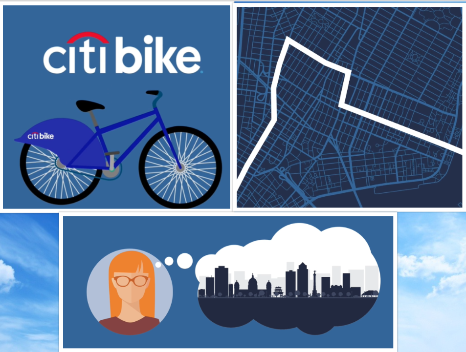
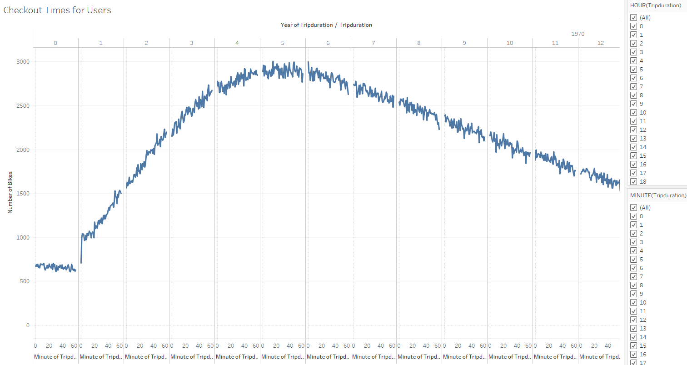
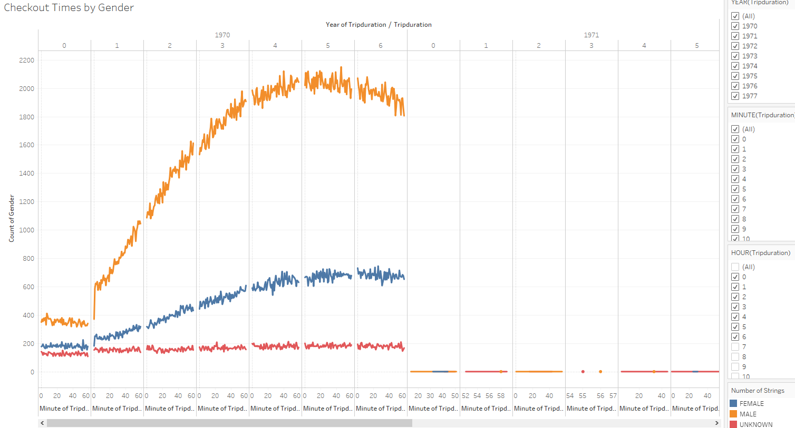
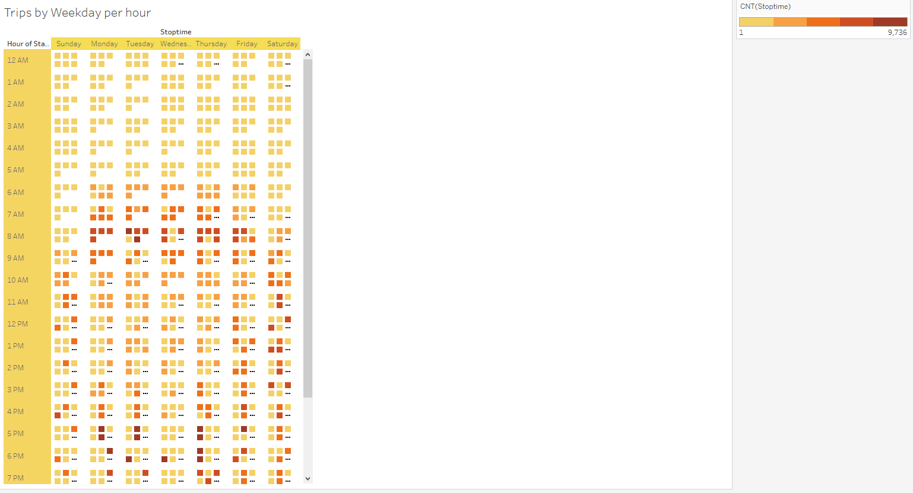
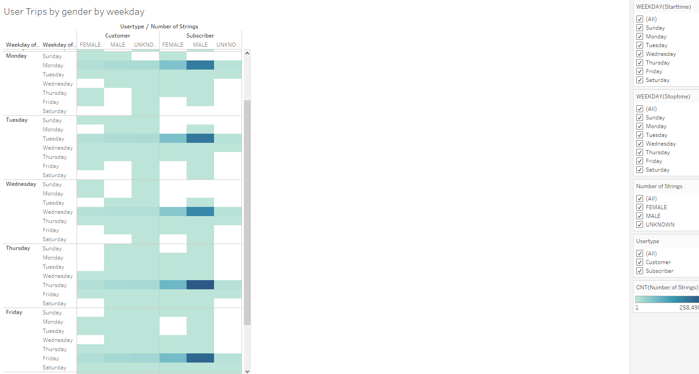

### bikesharing

### Project title: Presenting your prospective Angel investor with the right answers

The purpose of the analysis is to determine if the Citibike business model in New York can be replicated in Des Moines, Iowa. As the lead data analyst and visionary of this project I’m working with my friend and potential busines partner who jointly came up the idea with me on our recent trip to NYC. We found exploring the city on the bike gave us an opportunity to give a more authentic experience.  

### Analysis & Challenges:

A review of the August 2019 data was used as part of my preliminary analysis. This is the month that NYC is said to have the most traffic. So, the use for biking around the city becomes a viable option. However, it’s important to keep in mind that most business plans require a 2-5-year forecast. Therefore, it makes sense to look analyze at least 2016, 2017, and 2018 by quarter due to variance. I would also cross analyze the information with NYC Hotel Occupancy by month. In 2019 NYC & Company estimates that approximately 67 million visitors will have visited New York in2019. As a next step I would look at cities in the U.S. that share a similar metrics to Des Moines when it comes to domestic and international visitors. 

## The below visual data is used to aggregate the data found in the Citi Bike Trip for August 2019 to build a data dashboard, story, or report.  

